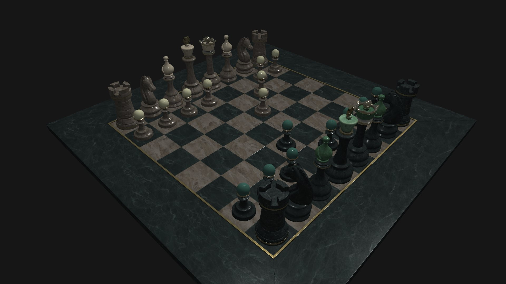
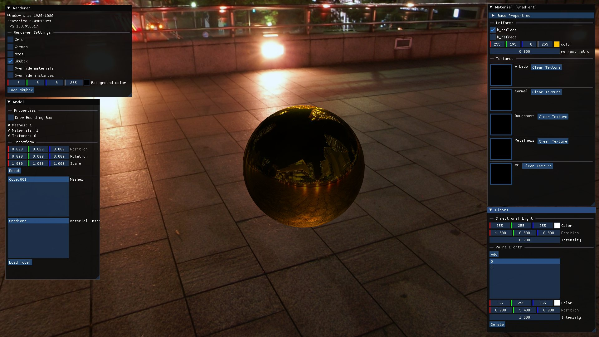
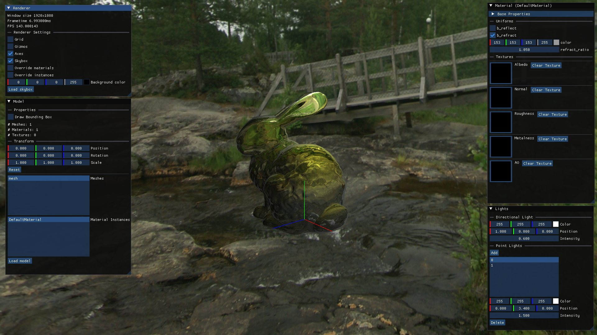
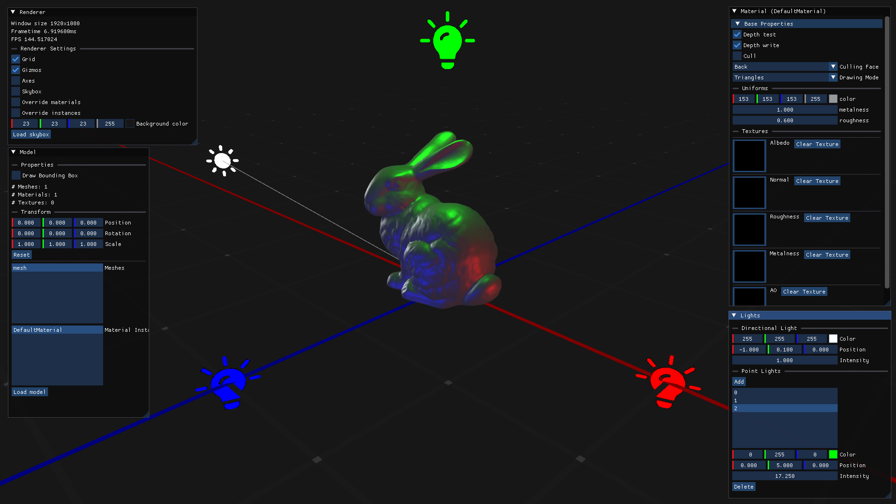

# Ptah

A real-time 3D rendering engine written in C++23 on top of OpenGL 4.6.

This is a learning project — I'm building it to understand how real-time renderers work from the ground up. It's not a product, it's not meant to be used in anything serious, and the API changes whenever I feel like it.

## Showcase



<table>
<tr>
<td width="50%">

<br><sub><b>Reflection</b> — the sphere samples the environment cubemap</sub>
</td>
<td width="50%">

<br><sub><b>Refraction</b> — same cubemap, with an adjustable index ratio</sub>
</td>
</tr>
</table>



<sub>The editor — renderer settings, model and transform inspector, material uniforms and texture slots generated from the shader's reflected layout, and light controls with gizmos.</sub>

## Features

Forward rendering, with:

- **Shading models** — Unlit, Lambert, Phong, Blinn-Phong, and a metallic/roughness **PBR** model (GGX / Smith / Schlick-Fresnel)
- **Lighting** — directional and point lights
- **Environment mapping** — cubemap skybox with reflection and refraction
- **Model loading** — via Assimp, with automatic resizing/repositioning from bounding boxes
- **Material system**
  - Materials own the shader program; **material instances** own per-object uniform data and texture bindings on top of a shared base
  - Material properties are **resolved by reflecting the shader's uniform block layout at link time** — nothing is hard-coded, so adding a uniform to a shader is enough to make it available in code and in the editor
  - Render state (cull face, depth test/write, draw mode) travels with the material
- **Shader hot reloading** — shaders are re-checked and recompiled on write, no restart needed
- **Shader preprocessing** — recursive `#include` support, plus `#define` injection from C++
- **Editor** — ImGui-based inspector for models, transforms, lights, and material instances. Uniform widgets are generated from the reflected layout, so shader uniforms show up automatically
- **Gizmos** — ground grid, world axes, light icons, wireframe bounding boxes
- **Orbit camera** — orbit / pan / zoom mouse controls

## Roadmap

- [ ] Image-based lighting
- [ ] Post-processing stack (HDR, gamma correction, bloom, …)
- [ ] Directional light shadows
- [ ] Dynamic environment mapping

## Building

Requires CMake 3.21+ and a C++23 compiler. Most dependencies are fetched automatically by CMake; ImGui is a submodule.

```bash
git clone --recurse-submodules https://github.com/CatB1t/ptah.git
```

```bash
cmake -S . -B build -G Ninja -DCMAKE_BUILD_TYPE=Release && cmake --build build
```

The binary lands in `build/bin/`. On Linux you'll also need the usual OpenGL/X11/Wayland dev packages (see [ci.yml](.github/workflows/ci.yml) for the exact list).

## Dependencies

[GLFW](https://github.com/glfw/glfw) · [glad](https://github.com/Dav1dde/glad) · [glm](https://github.com/g-truc/glm) · [Assimp](https://github.com/assimp/assimp) · [Dear ImGui](https://github.com/ocornut/imgui) · [spdlog](https://github.com/gabime/spdlog) · [stb_image](https://github.com/nothings/stb) · [portable-file-dialogs](https://github.com/samhocevar/portable-file-dialogs)

## License

Apache 2.0 — see [LICENSE](LICENSE).

---

<sub>This README was AI-generated and reviewed by me, [@CatB1t](https://github.com/CatB1t).</sub>
